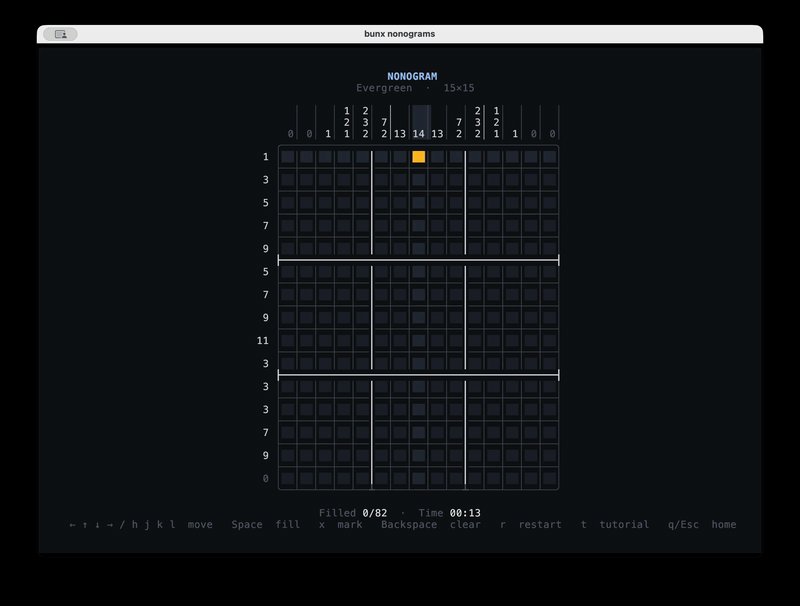

# Nonograms

Play nonograms in the terminal. Requires [Bun](https://bun.sh/) 1.2+.

```bash
bunx nonograms
```



## What is a nonogram?

A nonogram is a picture logic puzzle (sometimes called a Japanese Crossword). Use the number clues beside each row and column to determine which cells to fill, revealing a hidden image.

## Create your own puzzles

Puzzles come from [nonograms.exchange](https://nonograms.exchange) and are synced and cached locally at startup, so they work offline. You can create your own puzzles and save them locally or publish them to the website. You can also use your [OpenRouter](https://openrouter.ai/docs/quickstart) key to have AI assist you with puzzle generation.

## License

[MIT](LICENSE)
